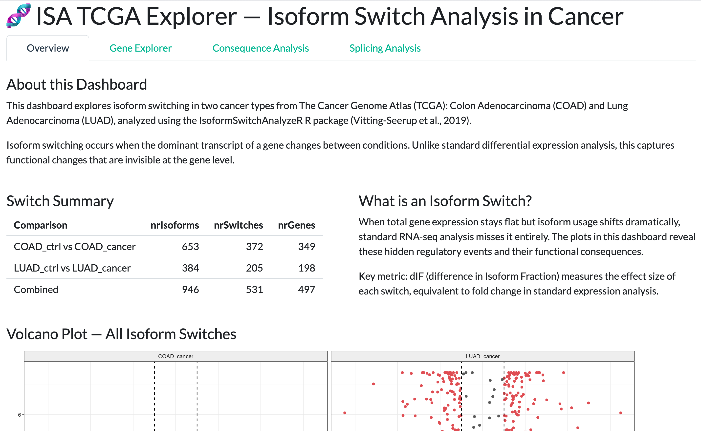
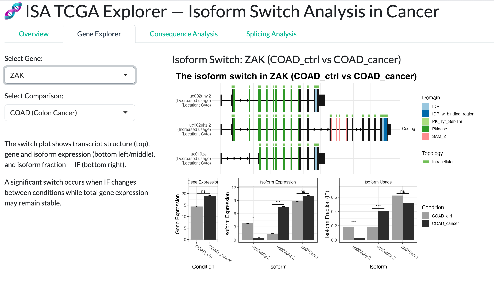
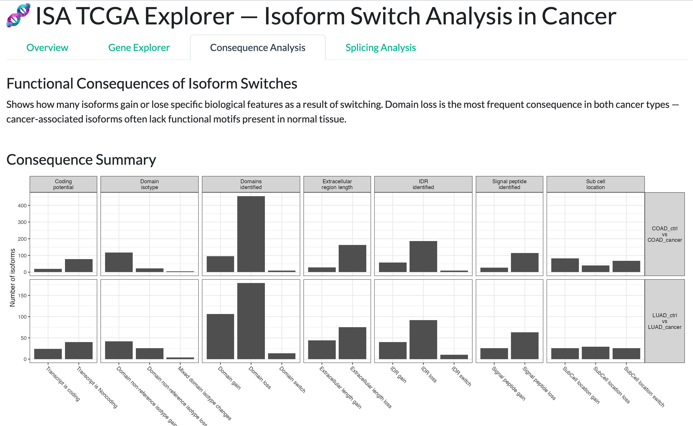
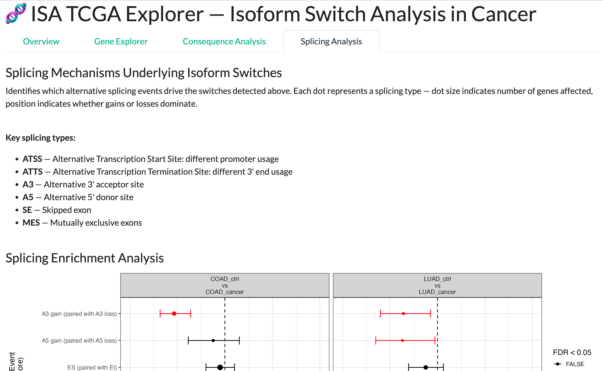

# ISA TCGA EXPLORER

An interactive R Shiny dashboard for exploring isoform switches in two types of 
cancers - COAD and LUAD using real TCGA RNA-seq data, built with the 
IsoformSwitchAnalyzeR Bioconductor package.

## About This Project

This project was built to develop hands-on experience with the IsoformSwitchAnalyzeR 
Bioconductor package. Starting from the package documentation, I explored the TCGA 
example dataset — inspecting the switchAnalyzeRlist object, running consequence and 
splicing enrichment analyses, and interpreting individual gene-level switch plots. 
The results were then integrated into an interactive Shiny dashboard.

A key finding from the analysis: COAD shows significantly more isoform switches than 
LUAD (372 vs 205), suggesting more widespread post-transcriptional dysregulation in 
colon cancer. Notably, the ZAK gene — involved in radiation response — switches to an 
isoform gaining a SAM_2 domain in cancer, while total gene expression remains unchanged, 
illustrating exactly the type of event standard differential expression analysis would miss.

## Background

Genes can produce multiple RNA transcripts through alternative splicing and 
alternative transcription start/end sites — these are called isoforms. Standard 
differential expression analysis operates at the gene level, missing cases where 
total gene expression is unchanged but the dominant isoform shifts between conditions 
(isoform switching). This dashboard detects and visualizes such switches using Isoform 
Fraction (IF) values — the ratio of isoform to total gene abundance — identifying 
significant switches where |dIF| > 0.1 and q < 0.05.
Detected switches are further annotated for functional consequences including 
gain/loss of protein domains, signal peptides, coding potential, and NMD sensitivity.

## Features

| Tab | Description |
|-----|-------------|
| Overview | Dataset summary table, key metric definitions, and a volcano plot of all isoform switches across COAD and LUAD |
| Gene Explorer | Interactive switchPlot for top 20 significant genes — shows transcript structure, gene expression, isoform expression, and isoform fraction (IF) across conditions |
| Consequence Analysis | Genome-wide summary of functional consequences (domain gain/loss, coding potential, signal peptides) and enrichment analysis testing whether losses are systematically more frequent than gains |
| Splicing Analysis | Enrichment analysis of alternative splicing mechanisms underlying detected switches (ATSS, ATTS, A3, A5, SE) — dot size indicates genes affected, position indicates gain/loss bias |


## Analysis Pipeline

```
Raw Salmon Quantification Files
        ↓
importIsoformExpression()
(import transcript-level counts and abundance)
        ↓
importRdata()
(integrate with GTF annotation → build switchAnalyzeRlist)
        ↓
isoformSwitchTestDEXSeq()
(statistical testing of isoform fraction changes between conditions)
        ↓
analyzeSwitchConsequences()
(predict functional consequences — domain loss/gain, NMD, coding potential)
        ↓
Visualization
├── switchPlot()          — individual gene level
├── extractConsequenceSummary()   — genome-wide consequences
├── extractConsequenceEnrichment() — loss vs gain bias
└── extractSplicingEnrichment()   — splicing mechanisms
```


> **Note:** This app requires >1GB RAM due to Bioconductor dependencies and is 
> designed for local or server deployment. Screenshots are provided below. 
> A live example of my Shiny deployment skills is available at my 
> [Isoform Switch Dashboard](https://riyaggarwal30.shinyapps.io/isoform-switch-dashboard/).

## Screenshots

### Overview


### Gene Explorer — ZAK (COAD)


### Consequence Analysis


### Splicing Analysis



## How to Run Locally

```r
# Install required packages
if (!require("BiocManager", quietly = TRUE))
    install.packages("BiocManager")
BiocManager::install("IsoformSwitchAnalyzeR")
install.packages(c("shiny", "ggplot2", "dplyr", "bslib"))

# Clone the repository and run
shiny::runApp("app.R")
```

## Data & Citation

**Data:** TCGA example dataset bundled with IsoformSwitchAnalyzeR.

**Citations:**

Vitting-Seerup K, Sandelin A. IsoformSwitchAnalyzeR: analysis of changes in 
genome-wide patterns of alternative splicing and its functional consequences. 
Bioinformatics. 2019;35(21):4469-4471.

Vitting-Seerup K, Sandelin A. The Landscape of Isoform Switches in Human 
Cancers. Molecular Cancer Research. 2017;15(9):1206-1220.

## Skills Demonstrated
`R` `Shiny` `IsoformSwitchAnalyzeR` `ggplot2` `Bioconductor` `RNA-seq` `Alternative Splicing` `TCGA`